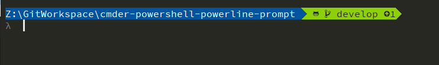

This is a fork of https://github.com/AmrEldib/cmder-powershell-powerline-prompt  

# cmder-powershell-powerline-prompt

Custom prompt (and other configurations) for PowerShell in [Cmder](http://cmder.net/).  

Untracked changes  
  
Tracked changes  
  
Local ahead of remote  


## Installation

Requires cmder to be set to use a [NerdFonts](https://github.com/ryanoasis/nerd-fonts) font.  
I use [SauceCodePro Regular Mono](https://github.com/ryanoasis/nerd-fonts/tree/master/patched-fonts/SourceCodePro/Regular)  

### WARNING: you are running a script with Unrestricted ExecutionPolicy. Make sure you trust the script to do what you think it does.

```powershell
git clone https://github.com/AridTag/cmder-powershell-powerline-prompt.git
cd cmder-powershell-powerline-prompt
PowerShell.exe -ExecutionPolicy UnRestricted -File .\install.ps1 <path to cmder installation>
```

## Aliases
Store aliases in `profile.d` folder. To easily manage aliases, create each alias in its own file with extension `.alias.ps1`.  
To store a private alias that you don't want to include in the repo, create it with extensions `.private.alias.ps1`.  

There's a special alias for quickly jumping to favorite folders: `goToFolder.alias.ps1`.  
Favorite folders are listed in the file `goToFolder.config` under `profile.d`.  
This file is a comma-separated file that lists an alias to a folder along with its target.  
For example: `c` sends me to `~\Code`.  
To use this command, I can simply type `g c` to go to `~\Code`.  

To add additional folder aliases, simply add additional entries in the `goToFolder.config` folder.  
See `profile.d\goToFolder.config.example` for example.  
